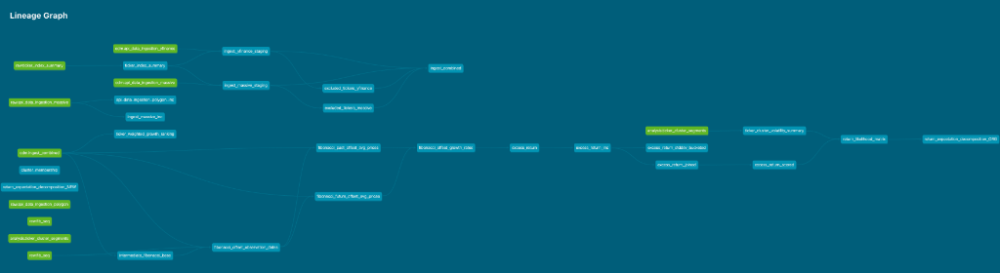
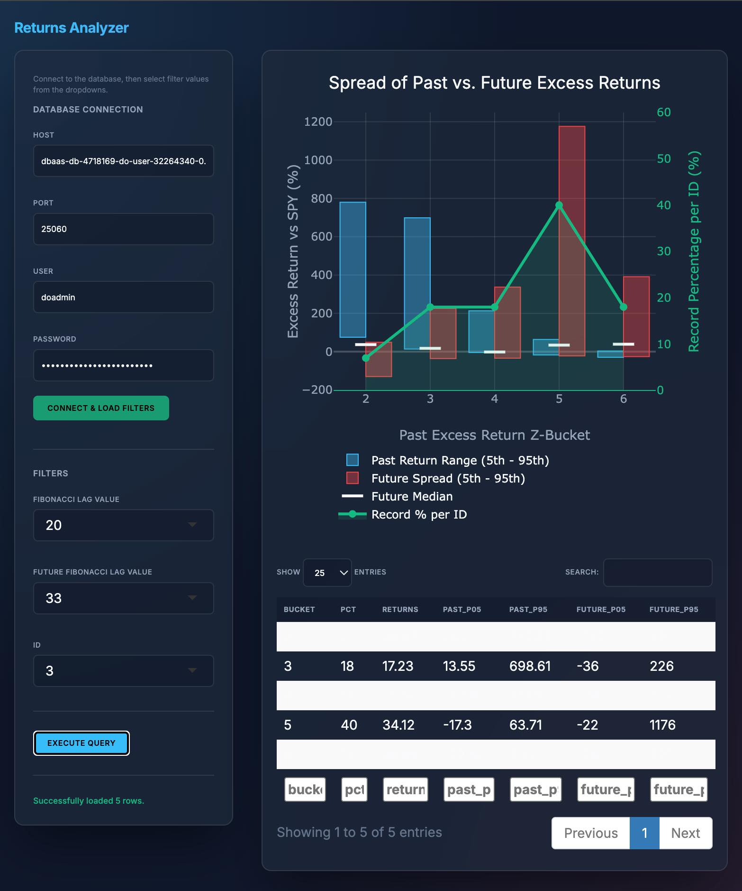

# ELT Canonical Data

This repository contains the infrastructure, ingestion pipelines, and canonical data models for the AlphaStream financial data system.

## Data Lineage

*The graph above visualizes the flow from raw data sources through transformations to the final canonical data models.*

## Interactive Analytics Dashboard

A live, cloud-connected R Shiny and Plotly dashboard used for data analysis and predictive inference visualization.
*   **Dual-Axis Visualizations:** Translates complex statistical relationships (P05/P95 spreads vs. historical outcomes) into highly interactive floating range bars.
*   **End-To-End Ownership:** Complete pipeline representation—from extraction via `psycopg2`, complex aggregations in `dbt`, to the final executive-facing UI.
*   **Data Integrity:** Validated historical datasets connected securely from managed DB infrastructure using real-time parameter injection and `htmlwidgets`.

## Project Timeline

*   **2024 — Foundation & Prototype**
    *   **Core Pipeline:** Built the ELT pipeline using Python, dbt, and Apache Airflow.
    *   **Data Modeling:** Designed the initial Canonical Data Model (CDM).
    *   **Environments:** Established separate local development and staging environments to test changes safely.

*   **2025 — Scale, Consolidation & Metrics**
    *   **API Migration:** Migrated ingestion to a more reliable market data API following the deprecation of the previous provider.
    *   **Consolidation:** Unified data from two external APIs into a single source, consolidating Raw → CDM tables.
    *   **Metrics Layer:** Developed a comprehensive metrics layer over the full historical dataset.
    *   **Cloud Deployment:** Deployed to Heroku to run pipelines in a hosted environment instead of locally.

*   **2026 — Containerization & Production Infrastructure**
    *   **Repo Split:** Divided code into public `elt-canonical-data` (infrastructure) and private `inference-models` (proprietary logic).
    *   **Docker:** Containerized the full stack to ensure portability and environment parity across local, staging, and production.
    *   **Infrastructure:** Migrated to DigitalOcean for simpler control and lower operating costs.
    *   **Managed DB:** Transitioned to a managed PostgreSQL database to offload backups, upgrades, and maintenance.

*   **Ongoing — Continuous Evolution**
    *   **Inference:** Developing and refining predictive inference models.
    *   **Quality:** Continuous performance tuning and data quality improvements.
    *   **Features:** Adding new features and extending analytical capabilities.

---

## Documentation

For technical details and setup guides, please refer to the `docs/` directory:

*   [**Architecture & Design**](docs/architecture.md): System overview, data flow, and environment strategy.
*   [**Development Guide**](docs/development_guide.md): Local setup, running tests, and Git workflows.
*   [**Operations Manual**](docs/operations_manual.md): Provisioning, deployment, and recovery procedures.
*   [**Security**](docs/security.md): Network security, SSH keys, and secret management.
*   [**Cheat Sheet**](docs/cheat_sheet.md): Quick reference for frequently used commands.
