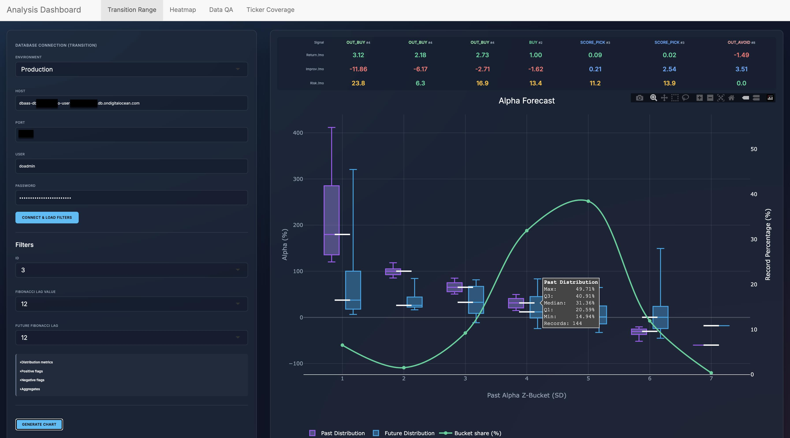

# AlphaStream

AlphaStream is an end-to-end data and analytics platform. It ingests time-series data, cleans and standardizes it, and produces statistical forecasts with an interactive dashboard on top.

## Repositories

AlphaStream is split into two repositories:

- **`elt-canonical-data`** (this repo, public) — the data layer. Ingestion, raw storage, cleaned canonical tables, and shared infrastructure and documentation.
- **`inference-models`** (private) — the forecasting and signal-generation layer that sits on top of the canonical tables.

## Data Lineage

### ELT — Canonical Data

From raw ingestion to the standardized, deduplicated tables that serve as the single source of truth for every downstream model.

### ETL — Forecasting & Signals

Statistical forecasting and signal-generation tables that sit on top of the canonical layer.

## Interactive Analytics Dashboard

Lets me visualize cohorts that share similar attributes and see, across lag time horizons spanning up to 40 years, how they tend to evolve.

**You can:**
- Compare past vs. future distributions side by side across groups.
- Filter dynamically by group, time window, and environment.
- See how many records back each group, so you know which ones to trust.

**Built with:** R + Shiny, Plotly, PostgreSQL, packaged in Docker so it runs the same locally and in production.

## Project Timeline

- **2024 — Foundation.** Built the ELT pipeline in Python, dbt, and Airflow; designed the initial canonical data model; stood up separate dev and staging environments to ship safely.
- **2025 — Scale.** Migrated ingestion to a more reliable market data API, consolidated data from multiple sources into a single pipeline, added a comprehensive metrics layer over the full historical dataset, and moved pipeline execution from local machines into the cloud.
- **2026 Q1 — Production Infrastructure.** Split the codebase into a public infrastructure repo and a private proprietary-logic repo, containerized the full stack with Docker for environment parity, migrated hosting to DigitalOcean, and switched to a managed PostgreSQL database to offload maintenance.
- **2026 Q2 — Forecasting & Dashboard.** Refactored the forecasting layer to improve signal quality and data integrity, added safeguards so unreliable results are flagged rather than shown as signals, polished the analytics dashboard, and formalized a ranked backlog of known model limitations.
- **Ongoing.** Continuous refinement of predictive models, performance tuning, and new analytical features.

---

## Documentation

See the `docs/` directory:

- [**Architecture & Design**](docs/architecture.md)
- [**Development Guide**](docs/development_guide.md)
- [**Operations Manual**](docs/operations_manual.md)
- [**Security**](docs/security.md)
- [**Cheat Sheet**](docs/cheat_sheet.md)
