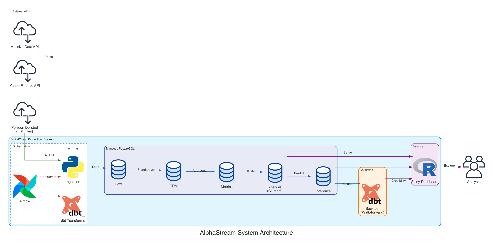
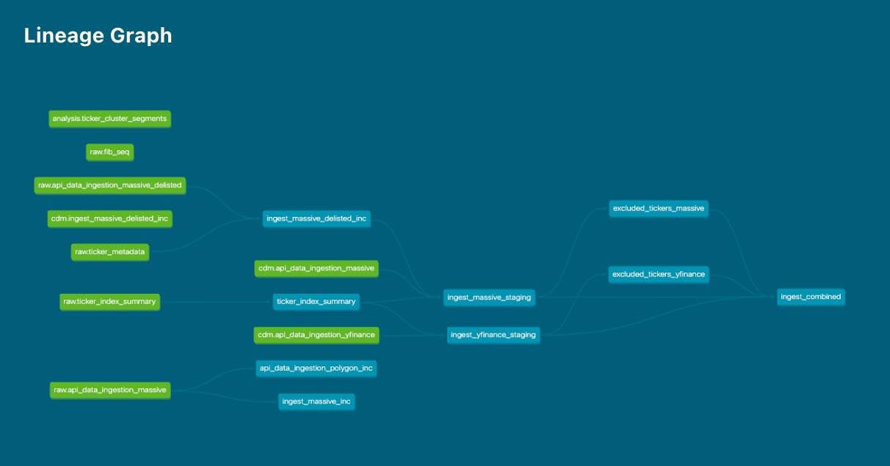
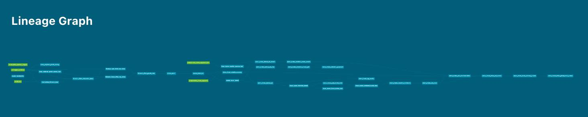
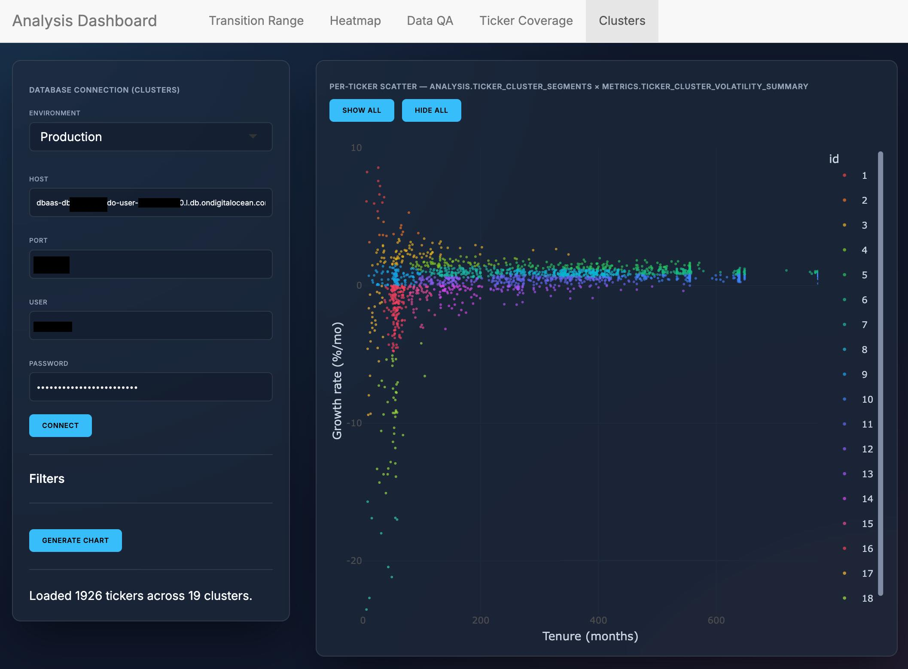

# AlphaStream

AlphaStream is an end-to-end data and analytics platform. It ingests time-series data, cleans and standardizes it, and produces statistical forecasts with an interactive dashboard on top.

## Repositories

AlphaStream is split into two repositories:

- **`elt-canonical-data`** (this repo, public) — the data layer. Ingestion, raw storage, cleaned canonical tables, and shared infrastructure and documentation.
- **`inference-models`** (private) — the forecasting and signal-generation layer that sits on top of the canonical tables.

## Environments

- Two pipeline setups: local and production (cloud)
- Three databases: dev, staging, and prod

## Data Lineage

### ELT — Canonical Data

From raw ingestion to the standardized, deduplicated tables that serve as the single source of truth for every downstream model.

### ELT — Forecasting & Signals

Statistical forecasting and signal-generation tables that sit on top of the canonical layer.

## Interactive Analytics Dashboard

Visualizes cohorts that share similar attributes across lag time horizons spanning up to 60 years.

Supports:
- Side-by-side comparison of past and future distributions across groups.
- Filtering by group, time window, and environment.
- Record counts per group to gauge reliability.

Built with R + Shiny, Plotly, and PostgreSQL. Packaged in Docker.

### Clusters

Groups items that behave alike into clusters and plots every member in a single view.

Supports:
- One point per member, placed by age and rate of change.
- Color-coding by cluster to compare groups at a glance.
- Toggling clusters on or off and switching environments.

## Project Timeline

**2024 — Foundation**
- ELT pipeline built on Python, dbt, and Airflow
- Initial canonical data model
- Separate dev and staging environments

**2025 — Scale**
- Migrated ingestion to a new data provider after the previous one was deprecated
- Consolidated multiple sources into a single pipeline
- Added a metrics layer over the historical dataset
- Moved pipeline execution to the cloud

**2026 Q1 — Production Infrastructure**
- Codebase split into a public infrastructure repo and a private logic repo
- Stack containerized with Docker
- Hosting moved to DigitalOcean
- Database switched to managed PostgreSQL

**2026 Q2 — Forecasting & Dashboard**
- Reworked the forecasting layer with walk-forward validation and trust scoring
- Expanded the dashboard with new views for ranges, coverage, and clusters
- Introduced new automated data-quality rules
- Added 200% data coverage, removing survivorship bias

**Ongoing**
- Continued model refinement
- Data QA, bug fixes, and optimization

---

## Documentation

See the `docs/` directory:

- [**Architecture & Design**](docs/architecture.md)
- [**Development Guide**](docs/development_guide.md)
- [**Operations Manual**](docs/operations_manual.md)
- [**Security**](docs/security.md)
- [**Cheat Sheet**](docs/cheat_sheet.md)
