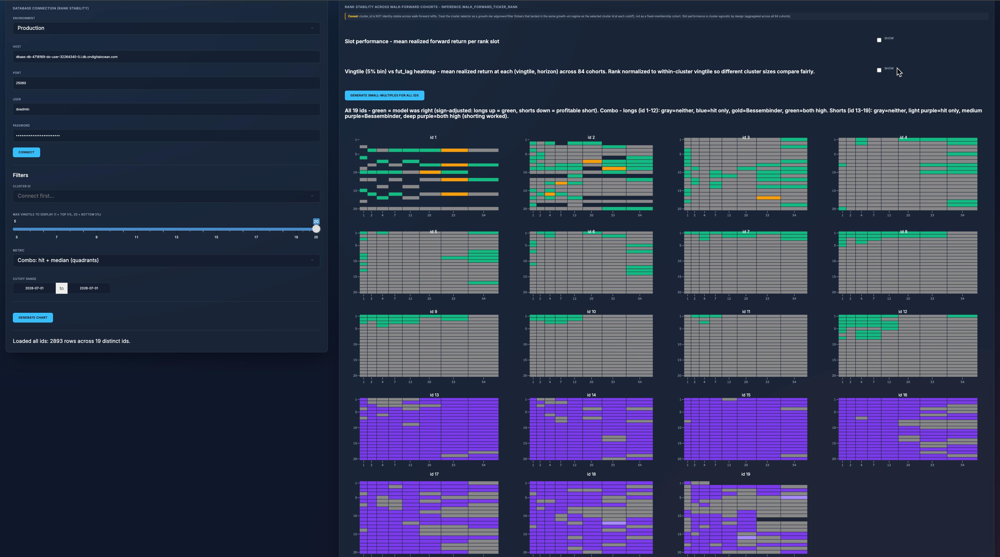

# AlphaStream

AlphaStream is an end-to-end data and machine-learning system. It ingests time-series data, cleans and standardizes it, then applies unsupervised clustering (Gaussian mixture models) and statistical scoring to rank groups, validated by walk-forward backtesting with no lookahead and trailing trust gates. An interactive dashboard sits on top.

Walk-forward backtesting shows 61.2% sign agreement across 643,466 cells (June 2026).

## Repositories

AlphaStream is organized into three repositories:

- **`elt-canonical-data`** (this repo, public) — the data layer. Ingestion, raw storage, cleaned canonical tables, and shared infrastructure and documentation.
- **`inference-models`** (private) — the modeling layer: unsupervised clustering, statistical scoring, walk-forward validation, and serving tables that sit on top of the canonical tables.
- **`qualstream`** (private, not yet integrated, ETA mid-August 2026) — a standalone weekly agent that produces a qualitative grade for each group member using an LLM with web research, written to a shared `qual` table in Postgres. The inference layer will read it to surface consensus selections, where the statistical grade and the qualitative grade agree. Intentionally decoupled: the only integration point is the shared Postgres.

## Environments

- Two pipeline setups: local and cloud (production)
- Three databases: dev and staging (local), prod (managed)

## Pipeline

The end-to-end flow grouped by stage, each box labeled with the database schema it lands in. Data is pulled in, screened for quality, and standardized into a canonical layer, then split into return features and clusters (unsupervised machine learning) that feed a statistical scoring stage, which walk-forward backtesting validates (no lookahead) before it reaches the serving tables the dashboard reads. The machine-learning stages are flagged in the diagram.

## Data Lineage

### ELT — Canonical Data

From raw ingestion to the standardized, deduplicated tables that serve as the single source of truth for every downstream model.

### ELT — Modeling & Scoring

Unsupervised clustering, statistical scoring, and walk-forward validation tables that sit on top of the canonical layer.

## Interactive Analytics Dashboard

Visualizes cohorts that share similar attributes across lag time horizons spanning up to 60 years.

The dashboard is an interactive R/Shiny app for exploring the model's outputs against real outcomes. You can stand at any point in the past and see which groups the model ranked highest at that time, using only information available then, and how those selections actually performed over the following window against a benchmark. It also shows the current live selections and tracks a running log of past selections forward in real prices.

Supports:
- Side-by-side comparison of past and future distributions across groups.
- Filtering by group, time window, and environment.
- Record counts per group to gauge reliability.

Built with R + Shiny, Plotly, and PostgreSQL. Packaged in Docker.

### Clusters

Groups items that behave alike into clusters and plots every member in a single view.

Supports:
- One point per member, placed by age and rate of change.
- Color-coding by cluster to compare groups at a glance.
- Toggling clusters on or off and switching environments.

### Rank Stability

Small multiples of rank stability across 84 walk-forward cohorts, one heatmap per cluster id. Each cell combines two signals at a given vingtile (5% rank bin) and horizon: whether the median beat its benchmark and whether the forecast direction was correct.

Supports:
- Green means the model was right: the median beat the benchmark and the forecast direction was correct.
- Longs (id 1-12) shade green when both hold; shorts (id 13-19) shade purple when the short worked.
- Filtering by environment, cluster, vingtile depth, metric, and cutoff range.

### Predictions (Backtest Replay)

Replays every ranked pick as it stood at each walk-forward cutoff and shows how it actually performed against the benchmark.

Supports:
- One bar per pick, sized by its realized excess return versus the benchmark over the hold window.
- Color by outcome: beat the benchmark, lagged, or delisted.
- Filtering by as-of date, replay horizon, cluster, and rank depth.

### Forecast

Stands at any past date and tracks the model's selections forward in real prices against the benchmark, with the walk-forward backtest as the expected path.

Supports:
- Selected set versus benchmark versus per-cluster backtest over the chosen hold length.
- A live out-of-sample log tracked on its own clock since the strategy went live.
- Alpha, beta, and information ratio for the selected window.

## Project Timeline

**2024 — Foundation**
- ELT pipeline built on Python, dbt, and Airflow
- Initial canonical data model
- Separate dev and staging environments

**2025 — Scale**
- Migrated ingestion to a new data provider after the previous one was deprecated
- Consolidated multiple sources into a single pipeline
- Added a metrics layer over the historical dataset
- Moved pipeline execution to the cloud

**2026 Q1 — Production Infrastructure**
- Codebase split into a public infrastructure repo and a private logic repo
- Stack containerized with Docker
- Hosting moved to DigitalOcean
- Database switched to managed PostgreSQL

**2026 Q2 — Forecasting & Dashboard**
- Reworked the forecasting layer with walk-forward validation and trust scoring
- Expanded the dashboard with new views for ranges, coverage, and clusters
- Introduced new automated data-quality rules
- Added 300% data coverage, removing survivorship bias

**2026 Q3 — Reliability & Data Quality**
- Added a point-in-time forecast view, tracking real picks forward against the benchmark
- Built a backtest replay, scoring every pick against the benchmark
- Added a live out-of-sample log, grading each published pick as prices arrive
- Gated forecasts to the rank ranges with proven edge

---

## Documentation

See the `docs/` directory:

- [**Architecture & Design**](docs/architecture.md)
- [**Development Guide**](docs/development_guide.md)
- [**Operations Manual**](docs/operations_manual.md)
- [**Security**](docs/security.md)
- [**Cheat Sheet**](docs/cheat_sheet.md)
