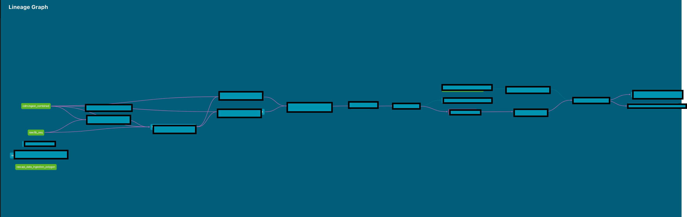
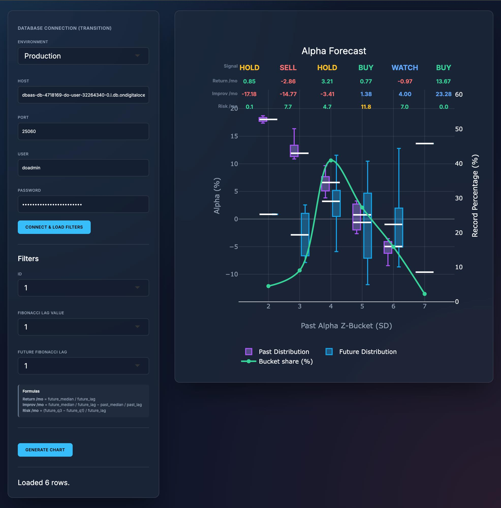

# ELT Canonical Data

Infrastructure, ingestion pipelines, and canonical data models for the AlphaStream data system.

## Data Lineage

### ELT Canonical Data

Ingestion → raw tables → canonical data models (CDM).

### ETL Inference

Metrics and inference tables. Table names masked for proprietary reasons.

## Interactive Analytics Dashboard

R / Shiny / Plotly dashboard for exploring alpha distributions across look-back and look-ahead horizons. Stack: **R, Shiny, Plotly, PostgreSQL.**

## Project Timeline

- **2024 — Foundation.** Built the ELT pipeline in Python, dbt, and Airflow; designed the initial CDM; set up dev + staging environments.
- **2025 — Scale.** Migrated ingestion to a more reliable market data API, consolidated Raw → CDM, added a metrics layer, deployed to the cloud.
- **2026 Q1 — Containerization.** Split the codebase into public infra (`elt-canonical-data`) and private logic (`inference-models`), dockerized the stack, migrated to DigitalOcean + managed Postgres.
- **2026 Q2 — Inference & Visualization.** Simplified the inference pipeline (removed a circular z-score layer, unified scoring), added viability enforcement + tail-risk, fixed intra-month smoothing with a month-end snapshot, polished the Shiny dashboard (Alpha terminology, proper boxplots, cleaner layout), and triaged the inference QA backlog.
- **Ongoing.** Refining inference models, tuning performance, extending analytics.

---

## Documentation

See the `docs/` directory:

- [**Architecture & Design**](docs/architecture.md)
- [**Development Guide**](docs/development_guide.md)
- [**Operations Manual**](docs/operations_manual.md)
- [**Security**](docs/security.md)
- [**Cheat Sheet**](docs/cheat_sheet.md)
