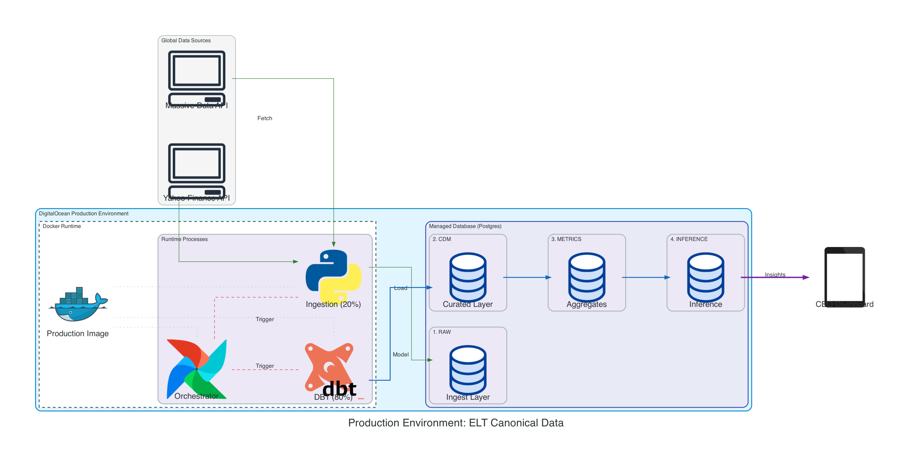

# Architecture & Design

This document explains the system design, data flow, and environment strategy for the AlphaStream system.

---

## 1. System Overview

The system uses an **ELT (Extract, Load, Transform)** pattern:

1.  **Extract**: Python scripts fetch data from APIs (Massive, Yahoo, Polygon).
2.  **Load**: Raw data is saved immediately to PostgreSQL (`raw` schema).
3.  **Transform**: dbt models clean and standardize data into the Canonical Data Model (`cdm` schema).

This separation ensures the **source data is preserved** independently of transformation logic, allowing safe reprocessing if business rules change.

---

## 2. Core Components

### Ingestion Layer
*   **Role**: Fetches data from external vendors.
*   **Behavior**: Resilient to API failures, handles rate limits, and performs automatic retries.
*   **Target**: Writes directly to the `raw` schema.

### Storage Layer
*   **Technology**: DigitalOcean Managed PostgreSQL.
*   **Structure**:
    *   `raw`: Exact copy of vendor data (Landing Zone).
    *   `cdm`: Clean, deduplicated, and standardized data (Serving Layer).
*   **Backup**: Automated daily backups with point-in-time recovery.

### Transformation Layer
*   **Tool**: dbt (Data Build Tool).
*   **Role**: Applies business logic (currency conversion, deduping, moving averages).
*   **Quality**: Runs automated data tests before promoting data to production tables.

### Orchestration Layer
*   **Tool**: Apache Airflow.
*   **Role**: Manages dependency execution (e.g., ensuring Ingestion completes before Transformation starts).

---

## 3. Environment Strategy

We use separate environments to ensure stability.

| Feature | Local (Mac) | Production (Linux Server) |
| :--- | :--- | :--- |
| **Purpose** | Development & Testing | Live Execution & "Source of Truth" |
| **Data** | Subset / Test Data | Full Historical Dataset |
| **Infrastructure** | Docker Desktop | Docker on DigitalOcean Droplet |
| **State** | Ephemeral | Persistent (Managed DB) |

**Deployment Rule**: The production server is an execution target only. All code changes are committed and tested locally before deployment.

---

## 4. Topology

### Development (Local)
*   **Code**: Local git repository.
*   **Runtime**: Local Airflow via Docker.
*   **DB**: Local PostgreSQL container.

### Production (Remote)
*   **Code**: Pulled from GitHub `main` branch.
*   **Runtime**: Authoritative Airflow instance.
*   **DB**: Managed PostgreSQL (external to the app server).

### Security
*   **Network**: Inbound traffic blocked by default. Only SSH (port 22) and Airflow UI (via tunnel) are accessible from whitelisted IPs.
*   **Access**: SSH Keys only (no passwords).
*   **Secrets**: Injected via environment variables at runtime; never stored in code.
